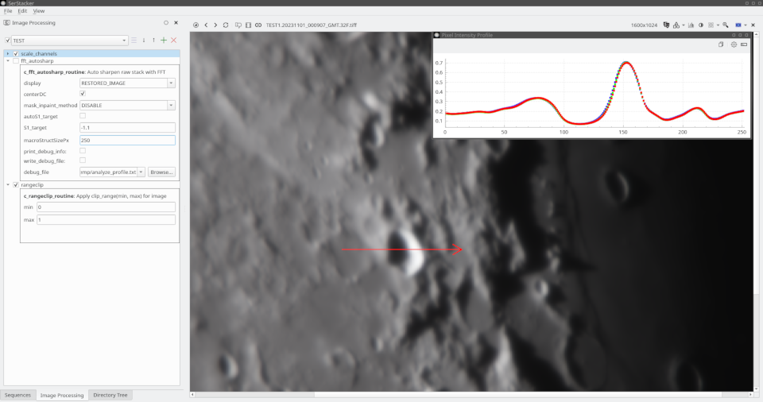
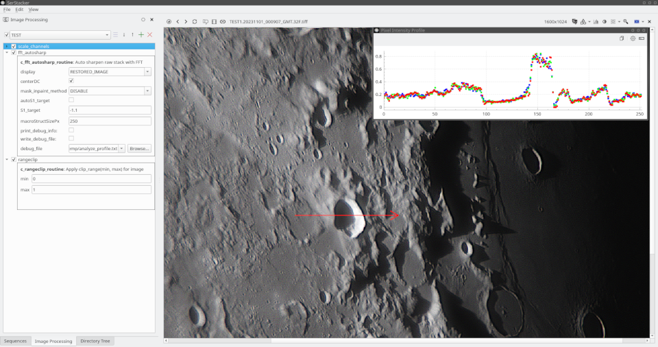
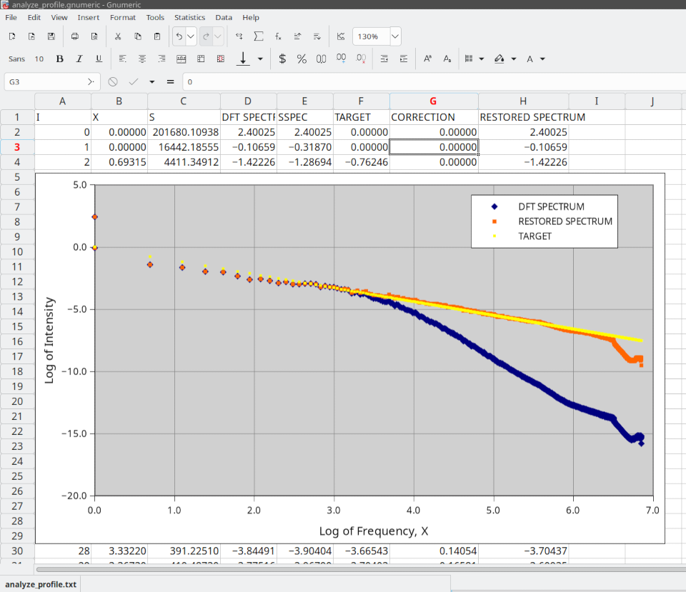

# c_fft_autosharp FFT-based image sharpening

`#include <core/proc/c_fft_autosharp.h>`

The c_fft_autosharp is specialized class for deblurring raw Lucky Imaging stacks basing on the analysis and modification of the Fourier spectrum. 
It can correct blur caused by atmospheric turbulence plus averaging of a large number of raw input frames by adjusting the radial profile of
the Fourier spectrum magnitude in logarithmic coordinates to match target slope.

Two screenshots below illustratre the result of applying the c_fft_autosharp filter to very blurry raw stack
assembled from ~2000 aligned camera frames.   

Input Image:



Restored Image:



Spectrum Profile:




## 🧠 Algorithmic basis

* **In-place CCS Packed Spectrum Processing:** 
	The algorithm operates directly on the packed CCS (Complex-Conjugate-Symmetric) spectrum in `CV_32FC1` format (`cv::DFT_REAL_OUTPUT`). 
All computations are performed without unpacking the data into an explicit complex representation (`CV_32FC2`) in memory to reduce RAM I/O overhead.


* **Grayscale and BGR images:** 
	The class can process single-channel (grayscale) and 3-channel (BGR) images. For color inputs, the Fourier spectrum
 analysis is performed only for the luminance component, for which the luminance channel **Y** of the **YCrCb color space** was selected.


* **Optimized Moizan PPS Decomposition:** 
	The pipeline uses **Virginie Moizan Periodic-Plus-Smooth decomposition** `fftPPSDecompositionCCS()` 
with analytical computation of the 2D CCS **boundary differences** (V) spectrum via two 1D DFTs of rows and columns `ftComputeVSpectrumCCS()`. 
This eliminates the need for an expensive full 2D DFT of the boundary differences matrix.


* **DFT Radial Profile and Inverse Filter Estimation:** 
	The `fftRadialProfileCCS()` function is used to create a histogram representing the radial profile of the DFT spectrum magnitudes.
	All frequencies up to the image corners are included, but only the **inscribed Nyquist ellipse** is used for the analysis. 
	The radial profile histogram is normalized,  converted to a logarithmic scale, and smoothed by `resampleAndSmoothRadialProfile()` function.
	The differences between the smoothed radial spectrum profile and the target straight line are used to generate an array of required corrections
	to ensure the corrected spectrum has the **S1_target** slope requested by the user or automatically estimated based on the local spectrum slope
	in the vicinity of the frequency range matching the requested **macroStructSizePx**.


* **Inverse filtering and BGR output generation:** 
	The **Inverse filter** generated is applied to all the **periodic (P-) complents** of multi-channel images separatelly
 (**Y, Cr, Cb **), the corresponding **smooth (S-) components** are inserted back, the inverse idft() is performad and finally all 
 the **YCrCb** color planes are convered back to **BGR** colorspace to form the output result.  


### Processing Pipeline (`FFT_AUTOSHARP_DISPLAY_RESTORED_IMAGE`)

```text
            [ INPUT: _srcImage, _srcMask, opts ]
                                    │
                                    ▼
                  Validate Channels (cn == 1 or cn == 3?)
                                    │
            ┌───────────────────────┴───────────────────────┐
            ▼ (cn == 1: Grayscale)                          ▼ (cn == 3: BGR)
    Has Mask & Inpaint Enabled?                     Has Mask & Inpaint Enabled?
      ┌─────┴─────┐                                   ┌─────┴─────┐
   [No]         [Yes]                              [No]         [Yes]
      │           │                                   │           │
      │     Calculate ROI (rc)                        │     Split to YCrCb planes
 Pad Border Copy Mask & Image                   Pad Border  Copy Mask & ROI
(Reflect101) Inpaint (Pyramid/Linear)          (Reflect101) Inpaint Y-plane only
      │           │                                   │           │
      └─────┬─────┘                                   └─────┬─────┘
            │                                               │
     PPS Decomposition                               PPS Decomposition
   (Extract P, S, V components)                    (Extract P, S, V components)
            │                                               │
            └───────────────────────┬───────────────────────┘
                                    │
                                    ▼
                         Compute Radial Profile
                          (fftRadialProfileCCS)
                                    │
                                    ▼
                          Create Inverse Filter
                  (createDFTInverseBlurCorrectionFilter)
                                    │
                                    ▼
                     Apply Filter to P-spectrum (Each Channel)
                        (fftMulSpectrumCCS)
                                    │
                                    ▼
                     Add Smooth Component S Back
                        (cv::add)
                                    │
                                    ▼
                        Inverse Fourier Transform
                        (cv::idft with DFT_SCALE)
                                    │
                                    ▼
                        Reconstruct Final Image:
                      (cn == 3 -> ycrcbPlanes2BGR)
                      (cn == 1 -> crop via ROI rc)
                                    │
                                    ▼
                         [ OUTPUT: _dstImage ]
```

