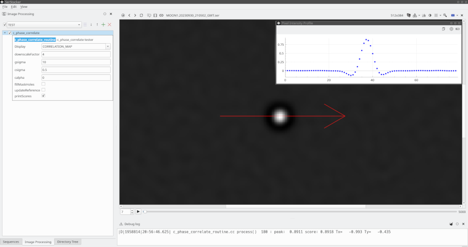
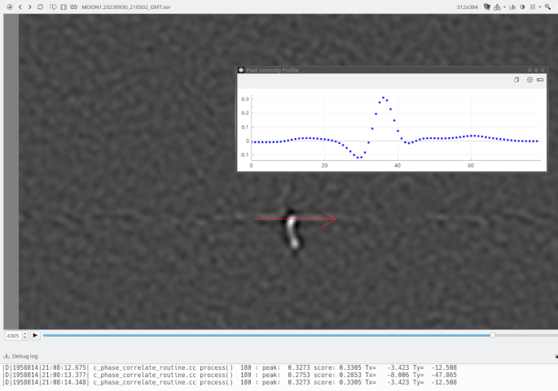

# c_phase_correlate

`#include <core/proc/image_registration/c_phase_correlate.h>`

The `c_phase_correlate` is a high-performance C++ class designed for fast sub-pixel translation alignment of shifted video frames under strict execution budgets. It is tailored specifically for **Lucky Imaging Stacking** pipeline, where thousands of short-exposure frames must be evaluated, aligned, and filtered at **maximum FPS**.

The pipeline implements an end-to-end optimized frequency-domain phase correlation algorithm that operates directly on packed real-valued spectra, bypassing conventional overheads to maximize frame throughput.



## 🚀 Key Optimization Features for High-FPS Stacking

To handle high-frame-rate inputs without becoming a pipeline bottleneck, the class merges several mathematical operations into low-level execution passes:

* **Zero-Cost Frequency Centering (`dftShift` Avoidance):** The spatial frequency sign-alternation factor \((-1)^{x+y}\) is pre-baked directly into the bandpass filter coefficients. This eliminates the CPU/cache overhead of traditional quadrant-swapping loops entirely.
* **Direct Real-DFT Packed CCS Arithmetic:** All complex conjugation, phase whitening, and bandpass weightings are processed in place using OpenCV's native **Compact Complex Store (CCS)** format. This minimizes memory bandwidth footprints and allows the utilization of highly efficient real-output Inverse DFTs (`cv::DFT_REAL_OUTPUT`).
* **Adaptive Feature Scale Tuning:** Uses an integrated Rayleigh-like Gaussian bandpass filter controlled by `gsigma`. This acts as the primary "tuning knob" to give higher priority to specific structural texture scales of the target (e.g., planetary details, lunar craters, or stellar cores) while instantly discarding low-frequency atmospheric gradient shifts and high-frequency sensor noise.
* **Downscaled Even-Grid Topology:** Enforces downscaled, strictly even-dimensioned workspace dimensions (`_fftSize`). This maintains perfect frequency-domain mirror symmetry for the baked filter while shrinking the FFT computational canvas to match the required processing resolution.
* **Arbitrary Visibility Masking:** Supports pixel-level current and reference masks with built-in inverse cross-filter deconvolution (`csigma`, `calpha`) to seamlessly mitigate spectral leakage and edge artifacts caused by irregular ROI boundaries.


## 📐 Grid Topology & FFT Size Constraints

A critical architectural feature of the pipeline is its strict enforcement of **even-dimensioned frequency grids** during the initial setup phase. The `setup` method configures the pipeline layout and computes the optimal workspace processing size `_fftSize` via custom constraint logic.

### 🧩 Downscaled FFT Size Optimization Logic

Standard hardware acceleration for Discrete Fourier Transforms relies on specific matrix padding up to the next optimal composite number (using `cv::getOptimalDFTSize`). However, to maintain boundary safety under downscaling constraints, this pipeline employs a downward-search strategy (`getOptimalFFTSizeDown`):

1. **Downscaling Boundary Protection:** Instead of padding the image *upward* (which could introduce artificial border artifacts or exceed expected limits), the system rounds down to the nearest optimal transform size that remains smaller than or equal to the downscaled frame size.
2. **Strict Parity Enforcement (Even Dimensions):** The optimization loop guarantees that both the width and height of the computed `_fftSize` are **strictly even numbers** (`sopt & 0x1 == 0`), establishing a minimum fallback size of \(4 \times 4\) pixels.

### ⚖️ The Mathematical Necessity of Even Discretization

Enforcing even spatial dimensions is mathematically mandatory due to the optimization tricks utilized in the pipeline core:

* **Symmetry of the Baked Sign-Alternation:** Because the quadrant-shifting factor \((-1)^{x+y}\) is embedded directly into the `_bandpassFilter`, the coordinate system requires perfect mirror symmetry across the Nyquist boundaries. An odd dimension would shift the phase center by a fractional pixel relative to the array grid, rendering the bandpass filter non-symmetrical.
* **CCS Boundary Safety:** The packed Real-DFT **Compact Complex Store** (CCS) format expects exact Nyquist frequencies to fall squarely onto the last row and column boundaries when the dimensions are even. Even grid sizing prevents frequency misalignment and phase artifacts when performing arithmetic cross-multiplication directly inside the packed memory space.

## 🎯 Frequency Bandpass Filter Generation & Feature Tuning

The `generateBandpassFilter` method pre-calculates the frequency-domain weighting matrix (`_bandpassFilter`). This component acts as the **primary tuning knob** of the alignment pipeline, allowing the system to isolate and prioritize specific spatial feature scales (textures, patterns, or boundaries) while suppressing unwanted noise and illumination artifacts.

### 📐 Mathematical Formulation & Feature Isolation

When a valid feature scale is specified (`_gsigma > 0`), the function populates a 2D grid mapped to the `_fftSize` canvas using a Rayleigh-like frequency distribution curve:

\[H(u, v) = (-1)^{x+y} \cdot \rho^2 \cdot e^{-0.5 \cdot \rho^2}\]

Where the normalized radial frequency metric \(\rho^2\) is derived from the spatial coordinate frequencies \((u, v)\) scaled by the target texture characteristic size:

\[\rho^2 = (u^2 + v^2) \cdot \left( \frac{\pi^2 \cdot \sigma_{\text{target}}^2}{2} \right)\]

* **Bandpass Behavior:** The \(\rho^2 \cdot e^{-0.5 \cdot \rho^2}\) profile effectively shapes a zero-DC bandpass filter. It inherently cuts off the constant global illumination component (DC at \(\rho=0\)) and acts as a smooth low-pass roll-off to eliminate high-frequency pixel jitter and sensor noise.
* **Feature Scale Selection:** Adjusting `gsigma` shifts the peak frequency response. This allows the pipeline to selectively lock onto structural textures of a specific pixel size while ignoring large-scale gradient drifts or sub-pixel micro-noise.

---

### ⚡ Integrated Optimization Vectors

To ensure maximum frames-per-second (FPS), three heavy processing steps are combined into a single, cache-localized data-generation pass:

1. **Zero-Cost Spectrum Centering:** The spatial frequency sign alternation factor `((x + y) & 1) ? -1 : 1` is multiplied directly into the filter coefficients. This mathematical transformation pre-shifts the coordinate origin, completely bypassing the performance overhead of an explicit `cv::dftShift` quadrant swap loop after the inverse transform.
2. **Mask-Edge Deconvolution:** If mask compensation parameters are active (`_csigma > 0` and `_calpha > 0`), the pipeline embeds an inverse cross-filter matrix directly into the weights via pixel-wise multiplication (`cv::multiply`). This neutralizes spectral leakage caused by sharp geometric boundaries of arbitrary visibility masks without requiring spatial-domain apodization windows.
3. **L1 Normalization:** The final matrix is fully normalized using the L1 norm (`cv::NORM_L1`), ensuring that energy distribution remains consistent across varying frame dimensions and scaling adjustments.


## 🎯 Subpixel Peak Localization & Overlap-Compensated Scoring

Once the `cv::idft` yields the real-valued `_correlationMap`, the pipeline extracts the final displacement vector and computes a normalized quality score. This stage handles atmospheric degradation effects and translation scaling.

### 🔬 Non-Linear 5x5 Centroid Matrix with Pixel-Locking Prevention

The `findSubpixelCentroid` method localizes the translation vector with high subpixel accuracy. Atmospheric turbulence often warps the correlation peak, splitting or flattening its energy distribution. Standard quadratic or parabolic fittings fail in these conditions. The pipeline uses an advanced center-of-mass approach inside a \(5 \times 5\) spatial window (\(R=2\)):

1. **Adaptive Sidelobe Thresholding:** A dynamic floor is set at 20% of the discrete global maximum (\(z_{\text{center}}\)):
   \[\text{threshold} = 0.20 \cdot z_{\text{center}}\]
   This removes the ripple artifacts and secondary sidelobes generated by the bandpass filter, isolating the core peak structure.
2. **Cubic Weighting Scheme:** For all points within the neighborhood where the correlation intensity exceeds the threshold, a non-linear weight factor \(w\) is evaluated:
   \[w = (\text{val} - \text{threshold})^3\]
   This cubic profile penalizes low-amplitude noise while heavily prioritizing the apex geometry. It eliminates **pixel-locking effects** (the systematic error where computed subpixel coordinates drift towards integer grids) and ensures stability when handling split peaks caused by seeing conditions.
3. **Scale and Offset Restoration:** The computed subpixel displacement is centered back relative to the frequency origin (`_fftSize / 2`), adjusted for region-of-interest crop offsets (`_referenceCropOffset`, `_currentCropOffset`), and scale-multiplied by `_downscale_factor` to return the absolute physical translation vector in unscaled pixel units.

---

### 🛡️ Dynamic Overlap Compensation Metric

A major flaw of raw phase correlation is that the peak height (`_peakValue`) naturally drops as the translation vector increases, simply because the overlapping area between the two frames shrinks. To evaluate frame alignment quality fairly during *Lucky Imaging* filtering, the final `_correlationScore` applies an explicit geometric compensation:

### 🛡️ Dynamic Overlap Compensation Metric

A major flaw of raw phase correlation is that the peak height (`_peakValue`) naturally drops as the translation vector increases, simply because the overlapping area between the two frames shrinks. To evaluate frame alignment quality fairly during *Lucky Imaging* filtering, the final `_correlationScore` applies an explicit geometric compensation:

```text
                  Effective Overlap Area Modification
   +------------------+                   +----------+-------+

   |                  |                   |          |///////|  <- Lost Area
   |    Reference     |  ------------->   |  Shared  |///////|     (Shifts dx, dy)
   |                  |  [dx, dy shift]   |  Overlap |///////|
   +------------------+                   +----------+-------+
```

1. **Relative Area Calculation:** The system determines the remaining linear overlap ratios \(k_x\) and \(k_y\), combining them into a relative shared area multiplier \(a_{\text{rel}} = k_x \cdot k_y\).

2. **Dynamic Exponential Regularization:** At high displacement vectors, the shared area becomes extremely small, making the score vulnerable to division-by-zero or noise inflation. The pipeline introduces a strict dynamic regularization factor based on the shortest overlap axis (\(k_{\text{min}}\)):
   \[\epsilon_{\text{dynamic}} = e^{-70.0 \cdot (k_{\text{min}} - 0.3)}\]
   * When the overlap area is high (\(k_{\text{min}} > 0.3\)), \(\epsilon_{\text{dynamic}}\) approaches zero, allowing pure area-normalized scoring.
   * If the frame displacement cuts the overlap below 30% (\(k_{\text{min}} < 0.3\)), the exponential penalty explodes, safely driving the `_correlationScore` to zero. This filters out frame mismatches and extreme drift scenarios.
   

## 🛠️ Application Integration, Parameters & Debugging

The `c_phase_correlate` architecture exposes internal cache matrices to simplify application-level tuning and pipeline debugging. By fetching internal buffers, applications can visualize the execution flow in real time—ranging from raw downscaled input pairs to complex intermediate cross-spectra layouts and the final subpixel correlation maps.

### ⚙️ Configuration Parameters (`c_phase_correlate_options`)

* `downscale_factor` (Default: `4.0`): Controls workspace canvas size reduction. Higher values exponentially boost execution speed but limit structural texture definition.
* `gsigma` (Default: `10.0` [px]): Sets the target feature spatial wavelength. Tunes the internal bandpass filter to lock onto specific details (e.g., craters, star cores) while discarding high-frequency sensor noise.
* `csigma` (Default: `0.5`): Specifies the blur size for inverse cross-filter mask boundary deconvolution.
* `calpha` (Default: `0.0`): Defines regularization stiffness. Prevents division-by-zero explosions on sharp visibility mask edges.

---

### 🎛️ Diagnostic & Visualization Pipeline

Your UI can hook into internal data matrices directly. Below is an engineering pattern for integrating the class into a streaming processing loop (`c_phase_correlate_routine`) with conditional visualization routing:

```cpp

bool c_phase_correlate_routine::reinitialize(const cv::Size & expectedFrameSize)
{
  return (_initialized = pc.setup(expectedFrameSize, opts));
}

bool c_phase_correlate_routine::process(cv::InputOutputArray image, cv::InputOutputArray mask)
{
  // 1. Manage Dynamic Setup and Lazy Re-initialization
  if (!_initialized || _updateReferenceImage) {
    if (!reinitialize(image.size())) return false;
  }

  // 2. Stream Ingest & Reference Capture
  if (_referenceImage.empty() || _updateReferenceImage) {
    if (!setReferenceImage(image, mask)) return false;
  }
  if (!setCurrentImage(image, mask)) return false;

  // 3. Fire the Core High-FPS Pipeline
  pc.setCurrentImage(_currentImage, _currentMask);
  
  cv::Vec2f Translation;
  const double score = pc.compute(Translation);
  
  if (_printScores) {
    CF_DEBUG("peak: %7.4f score:%7.4f Tx=%+9.3f Ty=%+9.3f", 
              pc.peakValue(), score, Translation[0], Translation[1]);
  }

  // 4. Debug Render Routing Matrix
  switch (_display)
  {
    case DISPLAY_CURRENT_IMAGE:
      _currentImage.copyTo(image);
      break;
      
    case DISPLAY_SHIFTED_BLEND_IMAGE: {
      // Direct validation of subpixel compensation performance
      cv::Mat tmp;
      shiftImage(_currentImage, tmp, Translation);
      cv::addWeighted(tmp, 0.5, _referenceImage, 0.5, 0, image);
      mask.release();
      break;
    }

    case DISPLAY_CORRELATION_MAP:
      // Direct raw access to the final unshifted peak matrix
      pc.correlationMap().copyTo(image);
      mask.release();
      break;

    case DISPLAY_CURRENT_SPECTRUM_CART:
      // Unpacks the internal CCS compact matrix for Cartesian view
      fftUnpackCCSSpectrum(pc.currentSpectrum(), image);
      fftSwapQuadrants(image, image); // Quadrant center shift
      mask.release();
      break;

    case DISPLAY_BANDPASS_FILTER:
      // Verifies baked Rayleigh-distribution grid symmetry
      fftSwapQuadrants(pc.bandpassFilter(), image);
      mask.release();
      break;
      
    default:
      break;
  }
  return true;
}
```

---

### 📊 Real-Time Diagnostic Interface Overview

When running the application with the `DISPLAY_CORRELATION_MAP` diagnostic flag turned on, the UI renders the internal matrix state directly. This layout provides an instant status report on target alignment characteristics:

```text
  +--------------------------------------------+   [Pixel Intensity Profile]

  | [X] c_phase_correlate                      |    Amp ^
  |  Display:      [ CORRELATION_MAP        v] |    0.75|        ..::..
  |  downscale:    [ 4                       ] |    0.5 |       .      .
  |  gsigma:       [ 10                      ] |    0.25|      .        .
  |  csigma:       [ 0.5                     ] |      0 +---..------------..---+---> px
  |  calpha:       [ 0                       ] |           (20% Threshold Sidelobe Cutoff)
  +--------------------------------------------+

  |                                            |   
  |                    (o)  <- Delta Peak      |   <- Sharp, symmetrical peak points
  |                         Subpixel Centroid  |      to a high-quality, jitter-free
  |                                            |      Lucky Stacking alignment lock.
  +--------------------------------------------+
```

1. **Delta Peak Evaluation:** The sharp white node in the middle of the dark canvas signifies a solid phase match. Diffuse, multiple, or split blobs signal extreme atmospheric turbulence or uncompensated scale/rotation errors.

2. **Sidelobe Inspection:** The real-time pixel intensity profile (displayed in the top chart window) confirms the behavior of the `findSubpixelCentroid` 20% floor cutoff. Sidelobe rings created by the bandpass filter are successfully masked out, restricting center-of-mass computations strictly to the primary subpixel peak window.


## ⚠️ Critical Production Anomalies & Mitigations

In real-world astronomical imaging and turbulent atmospheric conditions, several edge cases can degrade frequency-domain alignment. The processing application must actively monitor the pipeline's output metrics (`peakValue`, `correlationScore`, and `outputTranslation`) to isolate and discard corrupted frames.

### 1. Atmospheric Blur, Defocus, and Vibration Jitter

Severe image blur—caused by wind-induced telescope vibration, tracking errors, or rapid atmospheric seeing degradation—directly alters the geometric profile of the correlation response.
* **Symptom:** The correlation peak loses its sharp delta-like structure on the `_correlationMap`. It flatlines, stretches asymmetrically, or splits into multiple sub-peaks (as seen in cases of high-frequency directional vibration).
* **Mitigation Strategy:** During the *Lucky Imaging* selection pass, the application must monitor both `peakValue()` and `correlationScore()`. Frames where the confidence score falls below a user-defined threshold—**typically between 0.55 and 0.60**—must be strictly rejected and omitted from the stacking buffer.

---

### 2. Sensor Artifacts, Dust Donuts, and Matrix Scratches

Fixed, high-contrast spatial anomalies on the optical path (such as hot pixels, scratches on the sensor window, or out-of-focus dust particles on the matrix/barlow lens) create severe frequency-domain distortions.

```text
       Low-Contrast Target vs. High-Contrast Sensor Dust
 +-------------------------------------------------------+

 |   ~ Low-contrast planet ~                             |
 |     (Shifts per frame)       ( O ) <- Fixed Dust Donut|
 |                                       (Static, High Contrast)
 +-------------------------------------------------------+
                                    |
                                    v
         [ Gsigma Filter Isolates Target AND Dust ]
                                    |
                                    v
     False Correlation Peak Triggers on the Static Artifact!
```

* **Symptom:** If the actual astronomical target exhibits low contrast (e.g., a faint surface detail on Jupiter or a dim nebula core) while a static dust particle has sharp, high-contrast edges matching the `gsigma` bandpass frequency scale, the pipeline will lock onto the static sensor artifact rather than the moving target. This creates a false peak at `(0, 0)` or forces a zero-motion lock.
* **Mitigation Strategy:** These hardware defects bypass standard alignment techniques. Highly contrastive fixed artifacts **must be masked out** in the spatial domain using custom pixel masks passed to `setReferenceImage` and `setCurrentImage`. Alternatively, a fast spatial `inpaint` preprocessing routine should be applied to neutralise the defect regions prior to entering the DFT pipeline.

---

### 3. Edge Artifacts and Unrelated Frame Alignments

When the pipeline attempts to match completely unaligned, heavily corrupted, or entirely unrelated image frames, cross-correlation can synthesize false, high-amplitude ghost peaks near the margins of the frequency canvas.

* **Symptom:** Random noise patterns or geometric edge features can line up constructively at extreme offsets, producing a deceptively high `peakValue` localized close to the outer boundaries of the field of view.

* **Mitigation Strategy:** To prevent catastrophic misalignment, the software must evaluate the metrics as a combined triplet: `correlationScore()`, `peakValue()`, and the spatial magnitude of the `outputTranslation` vector. If a massive displacement vector is returned alongside a borderline confidence score, the frame must be flagged as a false positive and discarded.

The example screenshot illustrate the correlation peak deformation due to very strong image smear caused by telescope vibration.


