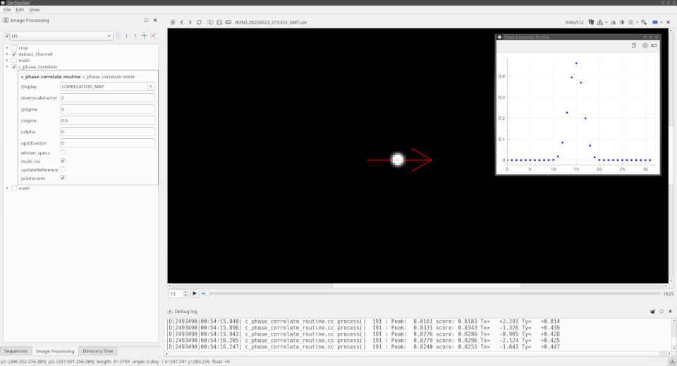
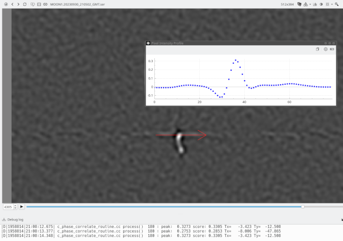

# c_phase_correlate

`#include <core/proc/image_registration/c_phase_correlate.h>`

# c_phase_correlate

The **c_phase_correlate** class implements a subpixel image alignment pipeline using cross-correlation and
 phase-correlation methods in the frequency domain. The algorithm is heavily optimized to minimize runtime 
 memory allocations, leverage multi-threaded execution (via `cv::parallel_for`), and mitigate boundary artifacts
 caused by ROI edges.



---

## Key Features & Core Functionality

The class estimates the precise 2D translation vector (dx, dy) between a Reference and a Current frame.

* **Packed Spectrum Optimization (CCS):** All frequency-domain operations are performed directly on OpenCV's packed CCS
 (Complex Conjugate Symmetrical) format for real-valued `CV_32FC1` matrices. This eliminates the memory and performance
 overhead of handling full complex `CV_32FC2` allocations.
 
 
* **Boundary Artifact Mitigation (Periodic + Smooth Decomposition):** The forward Discrete Fourier Transform (DFT) is computed via Moizan's PPS Decomposition (`fftPPSDecompositionCCS`). The input image is decomposed into periodic (P) and smooth (S) components. This suppresses cross-shaped boundary tearing artifacts without blurring or altering the informative high-frequency texture within the frame.


* **Optional Spectral Leakage Regularization (Inverse Cross-Filter):** To compensate for the "ray" artifacts induced by the rectangular boundaries of the input ROI, an inverse frequency-domain cross-filter matrix embedded with Tikhonov regularization is evaluated (`fftGenerateInverseCrossFilter`).


* **Multi-ROI Operation Mode:** Supports partitioning the frame into 4 independent spatial quadrants (patches). The pipeline extracts separate spectra for each patch and performs non-linear accumulation into a single cumulative correlation map (`updateMultiROICorrelationMap`).

---

## Pipeline & Filtering Methods

### 1. Data Packaging & Filter Generation (`generateFilters`, `setupInputImage`)

* **Downscaling & Layout Alignment:**
	Input frames and optional masks are downscaled by `downscale_factor`. The target FFT grid dimension is forced to be even and rounded down to the optimal DFT size via `getOptimalFFTSizeDown()` (or `getOptimalFFTSizeDownDiv4()` for Multi-ROI) to maintain perfect symmetry for the packed CCS layout.


* **Frequency Bandpass Filter:**
	When `_gsigma > 0`, the class evaluates a 2D Rayleigh-like distribution curve in the frequency domain 
	to isolate target textures. For each frequency coordinate (u, v) The transfer function of the filter is modeled as:
	`F(u, v) = rho2 * exp(-rho2)`. The square of the frequency radius is computed as `rho2 = (u^2 + v^2) * (ilambda^2)`.
	The characteristic frequency scale is defined as `ilambda = _gsigma / 0.283`.

 
* **Bandpass Behavior:**
 	The bandpass filter profile effectively shapes a zero-DC bandpass filter. 
	It inherently cuts off the constant global illumination component (DC at rho=0) and acts as a smooth low-pass 
	roll-off to eliminate high-frequency pixel jitter and sensor noise. Adjusting `gsigma` shifts the peak frequency response. 
	This allows the pipeline to selectively lock onto structural textures of a specific pixel size while ignoring 
	large-scale gradient drifts or sub-pixel micro-noise.


* **Embedded FFT-Shift:**
	The Rayleigh-like bandpass filter (controlled by `_gsigma`) is generated directly in the frequency domain with an embedded spatial chessboard sign-alternation: `sign(x, y) = ((x + y) & 1) ? -1.0 : 1.0`. This mathematical trick inherently shifts the zero-frequency (DC) component to the center of the spectrum, completely bypassing the runtime overhead of an explicit `fftShift` loop over the image matrices.


* **Cross-like artifacts suppression L1-Norm Normalization:**
	If `_csigma > 0` and `_calpha > 0`, a 2D cross-shaped frequency weight matrix with Tikhonov regularization 
	is evaluated via `fftGenerateInverseCrossFilter()` and multiplied with the bandpass filter to suppress rectangular
	ROI edge-leakage artifacts. The final filter matrix is normalized using the L1-norm (sum of absolute values equals 1.0).
	As a result, the autocorrelation peak value for a perfect match evaluated on an unscaled `cv::idft` equals exactly 1.0.

---

### 2. Frequency-Domain Alignment (`compute`)

Depending on the `whiten_specs` configuration flag, the cross-spectrum is processed through one of two execution paths:

* **Pure Phase Correlation (whiten_specs = true):**
Spectrum amplitudes are entirely whitened (normalized to 1.0), extracting only the phase difference between the current (S1) and reference (S2) fields:
`DST = filter * (S1 * S2*) / |S1 * S2*|`


* **Weighted Cross-Correlation (whiten_specs = false):**
The mutual spectrum preserves the cross-energy distribution of the amplitudes and scales the resulting map by the inverse square root of total cross-energy:
`DST = filter * (S1 * S2*) * (1.0 / sqrt(E_cross))`

---

### 3. Subpixel Centroid Analysis (`findSubpixelCentroid`)

* **Discrete Peak Search:**
The global integer-level maximum (x0, y0) is located on the real-valued cross-correlation map produced by the inverse DFT.


* **Cross-correlatiopn spot window sizing:**
The neighborhood radius R used to analyze the peak's center of mass is adapted based on `_gsigma` parameter 
and the correlation mode:
- If `whiten_specs == true`: `R = int(_gsigma) + 1`
- If `whiten_specs == false`: `R = int(2 * _gsigma) + 1`
- If `_gsigma <= 0`: `R = 2` (fallback minimal radius)


* **Anti-Pixel-Locking Weighting:**
To eliminate pixel-locking bias (systematic errors towards integer coordinates) and filter out residual bandpass sidelobes,
an adaptive intensity threshold is applied (10% of peak intensity for Single-ROI, 2% for Multi-ROI) combined with a 
non-linear weighting scheme:
- For Single-ROI: `W(x,y) = (I(x,y) - threshold)^3` (if I > threshold, else 0)
- For Multi-ROI: `W(x,y) = (I(x,y) - threshold)` (if I > threshold, else 0)

The refined subpixel peak position is then calculated as:
`Refined_X = x0 + sum(dx * W) / sum(W)`
`Refined_Y = y0 + sum(dy * W) / sum(W)`

---

### When to Use Multi-ROI Mode (`multi_roi = true`)

The `multi_roi = true` mode divides the computational frame into a 2 × 2 grid of four smaller sub-regions. 
The final alignment is derived by multiplying the phase correlation maps from all four quadrants. 
This approach is highly beneficial in specific imaging pipelines but introduces strict geometric and 
texture constraints.

#### Recommended Scenarios

* **Small or moderate Image Displacements:** 
This mode should be used only when the frame-to-frame translation is not much (significantly less than
half of the sub-window size). Since each FFT window is halved in dimensions, 
the maximum detectable offset is proportionally reduced.


* **Uniformly Distributed Texture:** 
Every quadrant must contain prominent structural or high-contrast texture features that significantly 
exceed the background noise floor.


* **DeepSky Astrophotography & Star Fields:** 
It is strongly recommended for aligning wide-field stellar images. 
Star fields can sometimes produce periodic patterns in the Fourier spectrum, 
creating a "comb" of false correlation peaks. Multiplying the correlation maps acts as a
non-linear spatial filter, isolating the singular true translation vector common to all
fields while completely suppressing side-lobes and ambiguous peaks.


#### Not Recommended Scenarios

* **Planetary Disks on Dark Backgrounds:** 
This mode should **strictly be avoided** when a single localized object is centered against an empty, dark sky. 
Splitting this frame into four quadrants leaves the outer sub-windows entirely blank or containing only sensor noise. 
Because the algorithm multiplies the maps sequentially (`cmap[x] *= rmap[x]`), the near-zero, noisy response 
from the empty quadrants will completely obliterate the clean correlation peak generated by the informative quadrant
containing the planet.


* **Large or Sudden Camera Shakes:** 
If the physical displacement exceeds the boundary limits of a single sub-window, the true peak wraps around due
to circular convolution, leading to total alignment failure.


* **Scenarios Involving Parasitic Rotation or Scale changes:** 
If the camera experiences even minor roll or zoom variations, the translation vectors across the four corners 
will point in different directions. Multiplying these mismatched maps will zero out the correct peak.


* **Sparse or Non-Uniform Scenes:** 
Avoid using this mode in studio environments with clean backdrops, or indoor scenes with large untextured walls,
where one or more quadrants lack high-frequency details.

---

## Key API Reference

### Configuration & Lifetime
* `bool setup(const cv::Size & expectedFrameSize, c_phase_correlate_options & opts)`  
  Calculates the optimal FFT grid dimensions taking into account the downscale factor and Multi-ROI settings. Allocates and pre-generates frequency-domain filtering matrices.
  
### Input Data Ingestion
* `bool setReferenceImage(cv::InputArray referenceImage, cv::InputArray referenceMask)`  
  Ingests, resizes, and packs the reference frame and its optional mask. Applies a Tukey apodization window (if configured) and extracts the single CCS spectrum (or 4 sub-spectra in Multi-ROI mode).
  
* `bool setCurrentImage(cv::InputArray currentImage, cv::InputArray currentMask)`  
  Performs identical processing steps on the current/moving target frame to extract its corresponding frequency spectra.

### Execution & Metrics
* `double compute(cv::Vec2f & outputTranslation)`  
  Executes the cross-spectrum evaluation, computes the IDFT, runs the subpixel peak interpolation, and projects the translation vector back into the pixel coordinate system of the original unscaled frame (accounting for crop offsets and downsampling). Returns an overlap-compensated alignment quality score (PSR-like metric).
  
* `double correlationScore() const`  
  Returns the quality score of the match, normalized against the estimated window overlap area.
  
* `double peakValue() const`  
  Returns the absolute intensity value of the primary correlation peak.

### 🛡️ Dynamic Overlap Compensation Metric

A major flaw of raw phase correlation is that the peak height (`_peakValue`) naturally drops as the translation vector increases, simply because the overlapping area between the two frames shrinks. To evaluate frame alignment quality fairly during *Lucky Imaging* filtering, the final `_correlationScore` applies an explicit geometric compensation:

```text
                  Effective Overlap Area Modification
   +------------------+                   +----------+-------+

   |                  |                   |          |///////|  <- Lost Area
   |    Reference     |  ------------->   |  Shared  |///////|     (Shifts dx, dy)
   |                  |  [dx, dy shift]   |  Overlap |///////|
   +------------------+                   +----------+-------+
```

1. **Relative Area Calculation:** The system determines the remaining linear overlap ratios \(k_x\) and \(k_y\), combining them into a relative shared area multiplier \(a_{\text{rel}} = k_x \cdot k_y\).

2. **Dynamic Exponential Regularization:** At high displacement vectors, the shared area becomes extremely small, making the score vulnerable to division-by-zero or noise inflation. The pipeline introduces a strict dynamic regularization factor based on the shortest overlap axis (\(k_{\text{min}}\)):
   \[\epsilon_{\text{dynamic}} = e^{-70.0 \cdot (k_{\text{min}} - 0.3)}\]
   * When the overlap area is high (\(k_{\text{min}} > 0.3\)), \(\epsilon_{\text{dynamic}}\) approaches zero, allowing pure area-normalized scoring.
   * If the frame displacement cuts the overlap below 30% (\(k_{\text{min}} < 0.3\)), the exponential penalty explodes, safely driving the `_correlationScore` to zero. This filters out frame mismatches and extreme drift scenarios.
   

## 🛠️ Application Integration, Parameters & Debugging

The `c_phase_correlate` architecture exposes internal cache matrices to simplify application-level tuning and pipeline debugging. By fetching internal buffers, applications can visualize the execution flow in real time—ranging from raw downscaled input pairs to complex intermediate cross-spectra layouts and the final subpixel correlation maps.

### ⚙️ Configuration Parameters (`c_phase_correlate_options`)

* `downscale_factor` (Default: `4.0`): Controls workspace canvas size reduction. Higher values boost execution speed 
and suppress high-frequency pixel noise, but limit structural texture definition.
* `gsigma` (Default: `5.0` [px]): Controls the radius of cross-correlation spot in cross-correlation map.
* `csigma` (Default: `0.5`): Specifies the blur size for inverse cross-filter mask boundary deconvolution.
* `calpha` (Default: `0.0`): Defines regularization stiffness. Prevents division-by-zero explosions on sharp visibility mask edges.

---

### 🎛️ Diagnostic & Visualization Pipeline

Your UI can hook into internal data matrices directly. Below is an engineering pattern for integrating the class into a streaming processing loop (`c_phase_correlate_routine`) with conditional visualization routing:

```cpp

bool c_phase_correlate_routine::reinitialize(const cv::Size & expectedFrameSize)
{
  return (_initialized = pc.setup(expectedFrameSize, opts));
}

bool c_phase_correlate_routine::process(cv::InputOutputArray image, cv::InputOutputArray mask)
{
  // 1. Manage Dynamic Setup and Lazy Re-initialization
  if (!_initialized || _updateReferenceImage) {
    if (!reinitialize(image.size())) return false;
  }

  // 2. Stream Ingest & Reference Capture
  if (_referenceImage.empty() || _updateReferenceImage) {
    if (!setReferenceImage(image, mask)) return false;
  }
  if (!setCurrentImage(image, mask)) return false;

  cv::Vec2f Translation;
  const double score = pc.compute(Translation);
  
  if (_printScores) {
    CF_DEBUG("peak: %7.4f score:%7.4f Tx=%+9.3f Ty=%+9.3f", 
              pc.peakValue(), score, Translation[0], Translation[1]);
  }

  // 4. Debug Render Routing Matrix
  switch (_display)
  {
    case DISPLAY_CURRENT_IMAGE:
      _currentImage.copyTo(image);
      break;
      
    case DISPLAY_SHIFTED_BLEND_IMAGE: {
      // Direct validation of subpixel compensation performance
      cv::Mat tmp;
      shiftImage(_currentImage, tmp, Translation);
      cv::addWeighted(tmp, 0.5, _referenceImage, 0.5, 0, image);
      mask.release();
      break;
    }

    case DISPLAY_CORRELATION_MAP:
      // Direct raw access to the final unshifted peak matrix
      pc.correlationMap().copyTo(image);
      mask.release();
      break;

    case DISPLAY_CURRENT_SPECTRUM_CART:
      // Unpacks the internal CCS compact matrix for Cartesian view
      fftUnpackCCSSpectrum(pc.currentSpectrum(), image);
      fftSwapQuadrants(image, image); // Quadrant center shift
      mask.release();
      break;

    case DISPLAY_BANDPASS_FILTER:
      // Verifies baked Rayleigh-distribution grid symmetry
      fftSwapQuadrants(pc.bandpassFilter(), image);
      mask.release();
      break;
      
    default:
      break;
  }
  return true;
}
```

---

### 📊 Real-Time Diagnostic Interface Overview

When running the application with the `DISPLAY_CORRELATION_MAP` diagnostic flag turned on, the UI renders the internal matrix state directly. This layout provides an instant status report on target alignment characteristics:

```text
  +--------------------------------------------+   [Pixel Intensity Profile]

  | [X] c_phase_correlate                      |    Amp ^
  |  Display:      [ CORRELATION_MAP        v] |    0.75|        ..::..
  |  downscale:    [ 4                       ] |    0.5 |       .      .
  |  gsigma:       [ 10                      ] |    0.25|      .        .
  |  csigma:       [ 0.5                     ] |      0 +---..------------..---+---> px
  |  calpha:       [ 0                       ] |           (20% Threshold Sidelobe Cutoff)
  +--------------------------------------------+

  |                                            |   
  |                    (o)  <- Delta Peak      |   <- Sharp, symmetrical peak points
  |                         Subpixel Centroid  |      to a high-quality, jitter-free
  |                                            |      Lucky Stacking alignment lock.
  +--------------------------------------------+
```

1. **Delta Peak Evaluation:** The sharp white node in the middle of the dark canvas signifies a solid phase match. Diffuse, multiple, or split blobs signal extreme atmospheric turbulence or uncompensated scale/rotation errors.

2. **Sidelobe Inspection:** The real-time pixel intensity profile (displayed in the top chart window) confirms the behavior of the `findSubpixelCentroid` 20% floor cutoff. Sidelobe rings created by the bandpass filter are successfully masked out, restricting center-of-mass computations strictly to the primary subpixel peak window.


## ⚠️ Critical Production Anomalies & Mitigations

In real-world astronomical imaging and turbulent atmospheric conditions, several edge cases can degrade frequency-domain alignment. The processing application must actively monitor the pipeline's output metrics (`peakValue`, `correlationScore`, and `outputTranslation`) to isolate and discard corrupted frames.

### 1. Atmospheric Blur, Defocus, and Vibration Jitter

Severe image blur—caused by wind-induced telescope vibration, tracking errors, or rapid atmospheric seeing degradation—directly alters the geometric profile of the correlation response.
* **Symptom:** The correlation peak loses its sharp delta-like structure on the `_correlationMap`. It flatlines, stretches asymmetrically, or splits into multiple sub-peaks (as seen in cases of high-frequency directional vibration).
* **Mitigation Strategy:** During the *Lucky Imaging* selection pass, the application must monitor both `peakValue()` and `correlationScore()`. Frames where the confidence score falls below a user-defined threshold—**typically between 0.55 and 0.60**—must be strictly rejected and omitted from the stacking buffer.

---

### 2. Sensor Artifacts, Dust Donuts, and Matrix Scratches

Fixed, high-contrast spatial anomalies on the optical path (such as hot pixels, scratches on the sensor window, or out-of-focus dust particles on the matrix/barlow lens) create severe frequency-domain distortions.

```text
       Low-Contrast Target vs. High-Contrast Sensor Dust
 +-------------------------------------------------------+

 |   ~ Low-contrast planet ~                             |
 |     (Shifts per frame)       ( O ) <- Fixed Dust Donut|
 |                                       (Static, High Contrast)
 +-------------------------------------------------------+
                                    |
                                    v
         [ Gsigma Filter Isolates Target AND Dust ]
                                    |
                                    v
     False Correlation Peak Triggers on the Static Artifact!
```

* **Symptom:** If the actual astronomical target exhibits low contrast (e.g., a faint surface detail on Jupiter or a dim nebula core) while a static dust particle has sharp, high-contrast edges matching the `gsigma` bandpass frequency scale, the pipeline will lock onto the static sensor artifact rather than the moving target. This creates a false peak at `(0, 0)` or forces a zero-motion lock.
* **Mitigation Strategy:** These hardware defects bypass standard alignment techniques. Highly contrastive fixed artifacts **must be masked out** in the spatial domain using custom pixel masks passed to `setReferenceImage` and `setCurrentImage`. Alternatively, a fast spatial `inpaint` preprocessing routine should be applied to neutralise the defect regions prior to entering the DFT pipeline.

---

### 3. Edge Artifacts and Unrelated Frame Alignments

When the pipeline attempts to match completely unaligned, heavily corrupted, or entirely unrelated image frames, cross-correlation can synthesize false, high-amplitude ghost peaks near the margins of the frequency canvas.

* **Symptom:** Random noise patterns or geometric edge features can line up constructively at extreme offsets, producing a deceptively high `peakValue` localized close to the outer boundaries of the field of view.

* **Mitigation Strategy:** To prevent catastrophic misalignment, the software must evaluate the metrics as a combined triplet: `correlationScore()`, `peakValue()`, and the spatial magnitude of the `outputTranslation` vector. If a massive displacement vector is returned alongside a borderline confidence score, the frame must be flagged as a false positive and discarded.

The example screenshot illustrate the correlation peak deformation due to very strong image smear caused by telescope vibration.


