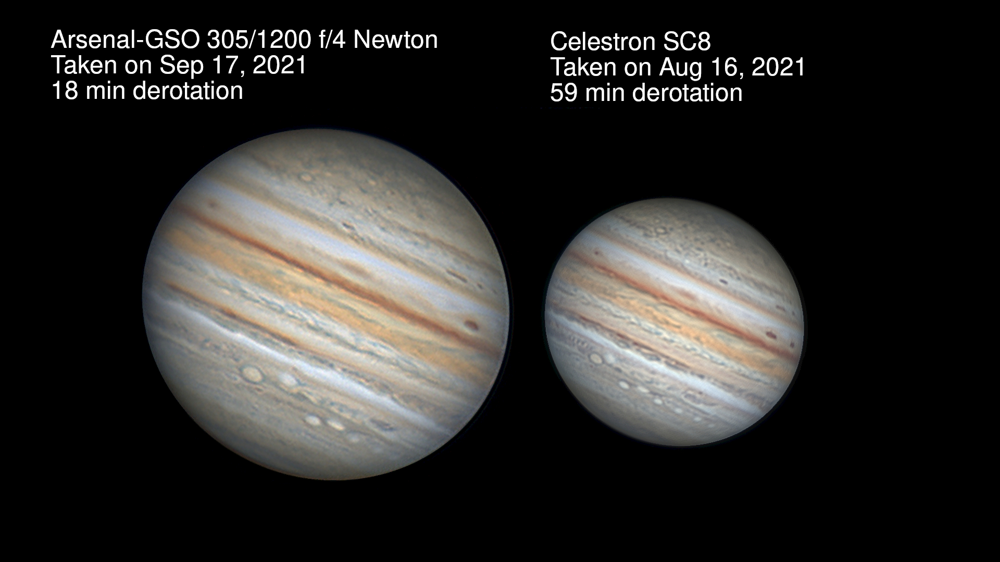
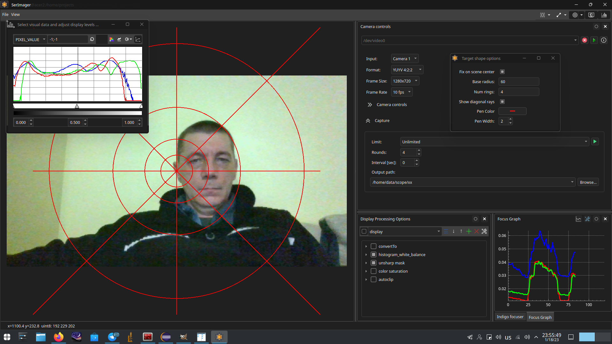
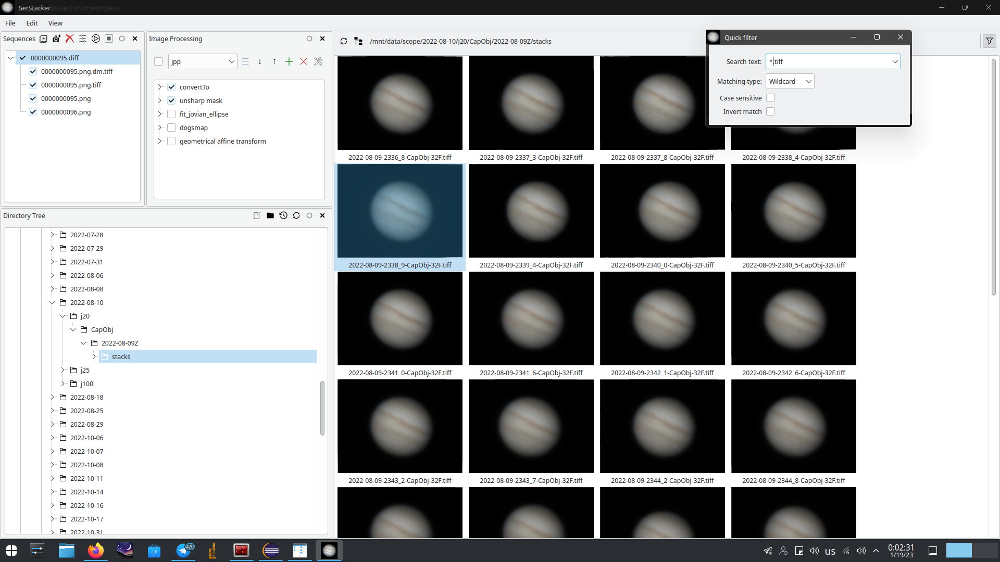

# SerStacker
Highly experimental code for planetary images stacking with OpenCV.

This code is intendend mainly for my experimentation.
It is totally bugged and constantly changed. 

## Example pictures

Jovian rotation captured at 2022-10-21 19:30 UTC with Arsenal-GSO N305/1200 f/4, ocular projection using x10 objective lens from microscope.

https://user-images.githubusercontent.com/1285263/197896096-c0db0918-69b4-436a-8746-0a7f94ff5705.mov


Montes Alpes and Mare Frigoris.


Compare jovian images captured with two different tubes, processed and derotated with SerStacker.



Test for microphotography focus stacking using simple weighted average of input frames. The pixel weights were computed as `W(x,y) = (6 * laplacian(x,y) ^2 +  gradient(x,y)^2) ^ 2` and smoothed using gaussian blur to get rid of potential discontinuites. The left pane is raw input from microscope with manually driven focus, the right is incremental average with some contrast and sharpenning enhacement.

https://user-images.githubusercontent.com/1285263/214982057-40cfd789-abfb-456f-b039-4115a8ff66d1.mov


SerImager Screen Shoot.



SerStacker Screen Shoot.




Examples of stacked images on my flickr account : 
  https://www.flickr.com/photos/116211323@N02/.

Examples of raw stacks (saved in TIFF format as 32-bit floats) on my google drive : 
  https://drive.google.com/drive/folders/16Ko6ebfuFToQyXbqewETryaVsAN_rmVS?usp=sharing

Jovian derotation+blend quick demo video:
  https://www.youtube.com/watch?v=ARGoWo2w8YY

## Build deps

The primary distribution is Arch Linux https://archlinux.org,  with fresh KDE environment. 
So I expect more or less fresh versions of Qt5/Qt6, OpenCV and other dependency packages. 
I have no posibility to test the build frequently on older versions of dependency packages 
like Ubuntu, Windows etch.  

	```
		$ mkdir build && cd build && cmake -DQT_VERSION=5 .. && make -j 4
	```


	Qt5 >= 5.10  (qt5-base qt5-declarative qt5-imageformats qt5-multimedia qt5-graphicaleffects)
	OpenCV >= 4.2
	TBB
	libconfig >= 1.7 
	libtiff
	libraw >= 0.20 (https://www.libraw.org)
	libopenraw-0.3 (https://libopenraw.freedesktop.org)
	cfitsio
	libavcodec
	libavformat
	libavutil
	libavdevice
	libswscale
	v4l-utils (Optional for SerImager)

Specially for glddm peoples to support the browsing of 3D point clouds generated by glddm apps (very limited functionality and *.ply format parser) :

	qt5-opengl 
	libQGLViewer >= 2.7 (http://libqglviewer.com)
	freeglut
	glew 2.2


Dependency packages for Ubuntu:

libtiff5-dev libraw-dev libopenraw-dev libcfitsio-dev 
libavcodec-dev libavformat-dev libavutil-dev libavdevice-dev libswscale-dev
qt5-default qtmultimedia5-dev v4l-utils-dev


